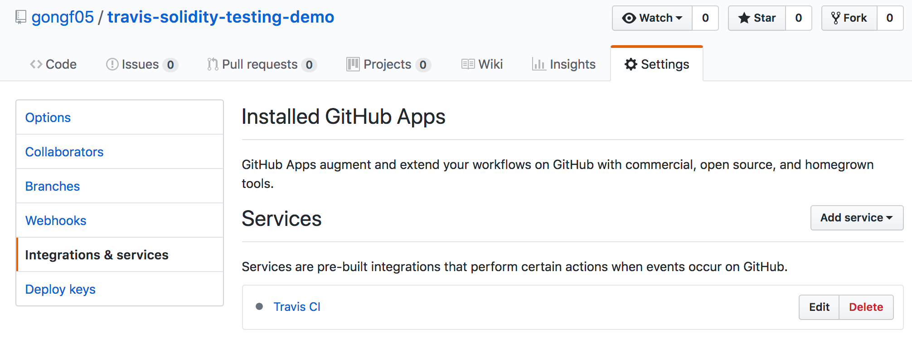

# travis-solidity-testing-demo
This demo shows how to perform the testing of Solidity project using travis CI.

## Operations

### 1. Sync Travis-CI with GitHub

Go to [https://travis-ci.org](https://travis-ci.org) and login with Github account. Then sync the Travis with Github so that all Github projects are list in Travis dashboard as below:

Then **flip the repository switch on** in front of Solidity project that needs Travis-CI. It shall looks like similar to below:

Go to the **Integration & Service** under **Settings** tab in the project. It shall include the Travis as a service. 

### 2. Create `.travis.yml` file

To enable Travis-CI, it is must to create a configuration file `.travis.yml` as below:

It list the specification for testing Solidity smart contract:

* declare the lanugage to be **node_js**
* install truffle and testrpc (install web3 if test files is written with JavaScript) in the section of `install`
* before run the test, launch the testRPC with `testrpc > testrpc.log &`
* Last, run `truffle test` and it will automatically compile the Solidity code.
* Test shall be executed in root directory. Otherwise, use `cd` command to enter the root directory that includes `truffle.js` and `contract/` directory.

Remember, change the network settings in `truffle.js` to use testRPC network:

### 3. Trigger the First Build with Git Push

Now it is ready to build the project and run the test. Try to push a commit to the repository, it will automatically compile and test the smart contract.

